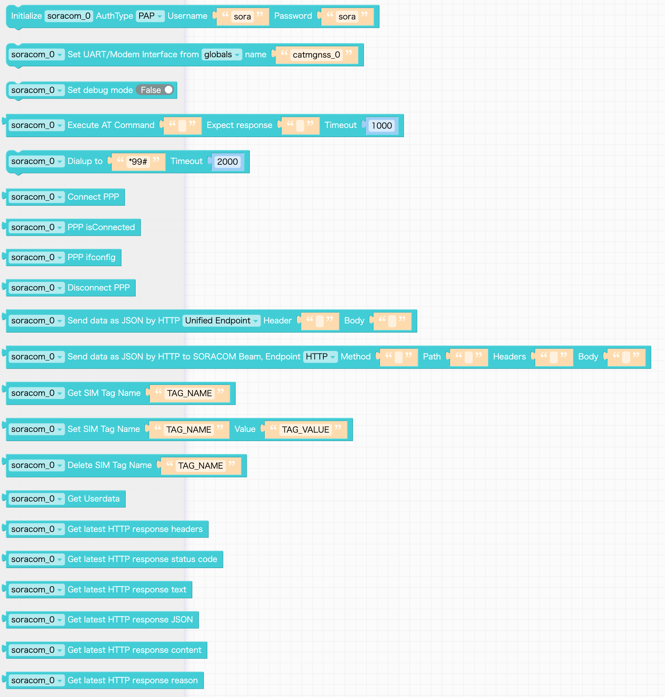

# SORACOM Custom Block for UIFlow2

UIFlow2 で SORACOM を使うときに便利な **SORACOM 非公式コードブロック** です。

## Features

- PPP 接続ユーティリティ
- AT コマンド送受信ユーティリティ
- SORACOM の各種データ転送サービスへのリクエスト（HTTP による JSON 形式での送信）
  - SORACOM Harvest Data, Funnel, Funk および Unified Endpoint への送信
  - SORACOM Beam の HTTP または Web サイトエントリポイントへの送信
- SORACOM のメタデータサービスへのリクエスト
  - SIM タグの取得・更新・削除
  - ユーザーデータの取得

> [!NOTE]
> - UIFlow2 v2.1.9 で動作を確認しています（v2.0.6 以降で動作すると推察されます）。
> - [Unit CatM+GNSS](https://docs.m5stack.com/en/unit/catm_gnss) で動作を確認しています。
>   - AT コマンドおよびダイヤルアップによる PPPoS 接続をサポートする通信モジュールで動作する可能性があります（未検証）。

> [!WARNING]
> 実装は MicroPython に準拠しますが、内部的に [UIFlow 用 MicroPython](https://github.com/m5stack/uiflow-micropython) にビルトインされたクラスを使用するため、将来的なバージョンアップ等により動作しなくなる可能性があります。



## How to use

事前にこのリポジトリのファイル群をクローン、またはダウンロードしてローカルに配置します。

### UIFlow2 へのインポート

1. UIFlow2 にアクセスし、ログイン状態でプロジェクトを作成します
2. 左下 `Custom (Alpha)` ブロック のインポート画面で `Soracom.m5b2` ファイルをインポートします
3. Custom (Alpha) セクションに Soracom コードブロックが追加されます。


#### 追加されない場合

.m5b2 ファイルをインポートしてもコードブロックが追加されない場合は、以下の操作を試してください。

- UIFlow からログアウトし、再ログインする
- ブラウザのキャッシュやローカルストレージをクリアする

また、以下の方法でコードブロックが表示される場合があることを確認しています（ファイルが破損する場合がありますので自己責任で実施してください）。

- `Export project to local file` でプロジェクトをローカルにダウンロード
- `.m5f2` ファイル内の JSON オブジェクト `resources` 配列内に `{"custom": ["custom_soracom"]}` を追加する
- 編集したプロジェクトファイルを `Import project from local file` でインポート

```
{
  "version": "V2.0",
  "versionNumber": "V2.1.9",
  "type": "core2",
  "components": [...],
  "resources": [
    {
      "software": ["http", "udp", "tcp"]
    },
    {
      "hardware": [...]
    },
    {
      "unit": [...]
+    },
+    {
+      "custom": [
+        "custom_soracom"
+      ]
+    }
  ],
  ...
```

### ライブラリの追加

お使いのデバイスに Soracom クラスファイルを追加します。

1. UIFlow2 の画面で WebTerminal を開く
2. File ボタンをクリック
3. `/libs/` フォルダをダブルクリック
4. `Send file to here` ボタンをクリックし、Soracom.py ファイルを転送
5. 転送が完了するのを待つ


### プログラムを構築する

コードブロックを配置し、プログラムを作成します。


## Author

[Hisaya OKADA](https://hsy.me/about)

> [!WARNING]
> - 本実装は SORACOM による推奨やサポートを提供・表明するものではありません。このリポジトリ内に含まれるファイルおよび記載の方法を実践したことによるいかなる事象について、作者および SORACOM は責任を負いません。
> - 使用方法に関する SORACOM への問い合わせはしないでください。
>   - 使用上の質問等はリポジトリの Issue 機能、または作者の X ([@Plemling138](https://x.com/Plemling138)) でお知らせください。

## LICENSE

MIT
